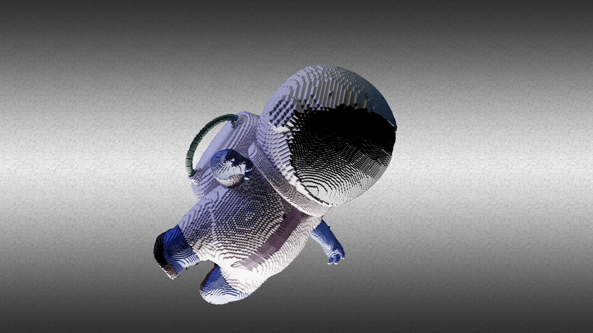

<h4 align="center">

## Fale Galerinha eu sou a Elvis Thermo, Desenvolvedor Fullstack!

- 🔭 Desenvolvedor de Javascript
- 💪 Desenvolvedor de Java
- 🧠 Visualização de dados
- 🌱 🎨 Artista 2D/3D 

  <a href="https://github.com/elvisthermo">
  
  

 
  
  
  
  
  
  
  

  

  
  ##
 

 
  
  
 
  

